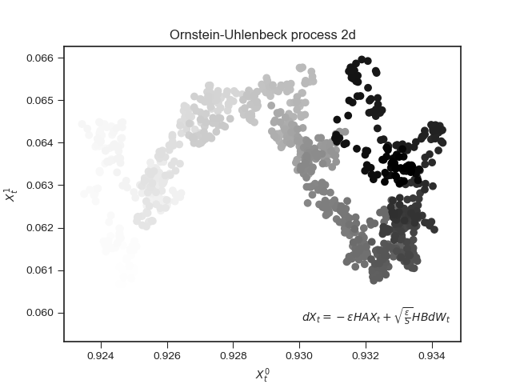

This is the repo for the project of studying the paper <a href="https://arxiv.org/pdf/1602.02666.pdf"> A Variational Analysis of Stochastic Gradient Algorithms </a>
## Setup  
First change to the project directory 
<code> cd ./VSGA </code>
Then install the requirements using <code>python-pip</code>

<code>
cd pip install -r requirements.txt
</code>
Every command below goes from the project root directory

## Run
You may decide to run a part of our experiments by executing the section below. Note that an important part of our experiments is done in Notebook files.
<code> python3 main.py   </code>

## Ornstein-Uhlenbeck 
An Ornstein-Uhlenbeck (OU) process is a continuous mean-reverting process (act like as a mechanical spring) commonly used in finance. 
In we paper we study, the authors have modeled the SGD as a OU process. This interpretation will yield interesting use cases for bayesian optimization.
Below is a realization of a 1D OU process 

 
 

## Tasks 
For every task, the code to execute it follows (ID=01, 02, 03)

<code> cd ./tasks && python3 taskID.py</code>

### Task 1

This task refers to the section about hyper-parameters optimization (§4.2). We aim at optimizing hyper-parameters by minimizing a posterior distribution. 
We use softmax regression on <a href="http://yann.lecun.com/exdb/mnist/"> MNIST </a> (50000 items for training, 10000 for validation, 784 features per item).
Please note that for this task, important details about the implementation were not found in the paper, therefore, our results may be far for those of the original paper. 

### Task 2
This task is identical to task 1, except we have changed the dataset to <a href="https://archive.ics.uci.edu/ml/datasets/covertype"> ForestCoverType </a> (464810 items for training, 116202 for validation, 54 categorical and continuous features) 
We have a normalization to the categorical features. 

### Task 3

For this task, we used the same pipeline, but applied to a toy dataset (taken from <code>scikit-learn</code>). The goal of this task is to be able to visualize the SGD process as well as a realization of the OU process. 
## Resources 

https://stats.stackexchange.com/questions/60680/kl-divergence-between-two-multivariate-gaussians
http://www2.myoops.org/cocw/mit/NR/rdonlyres/Mathematics/18-441Statistical-InferenceSpring2002/C4505E54-35C3-420B-B754-75D763B8A60D/0/feb192002.pdf
https://doi.org/10.1093/imamci/9.4.275
https://en.wikipedia.org/wiki/Lyapunov_equation
https://link.aps.org/doi/10.1103/PhysRev.36.823
